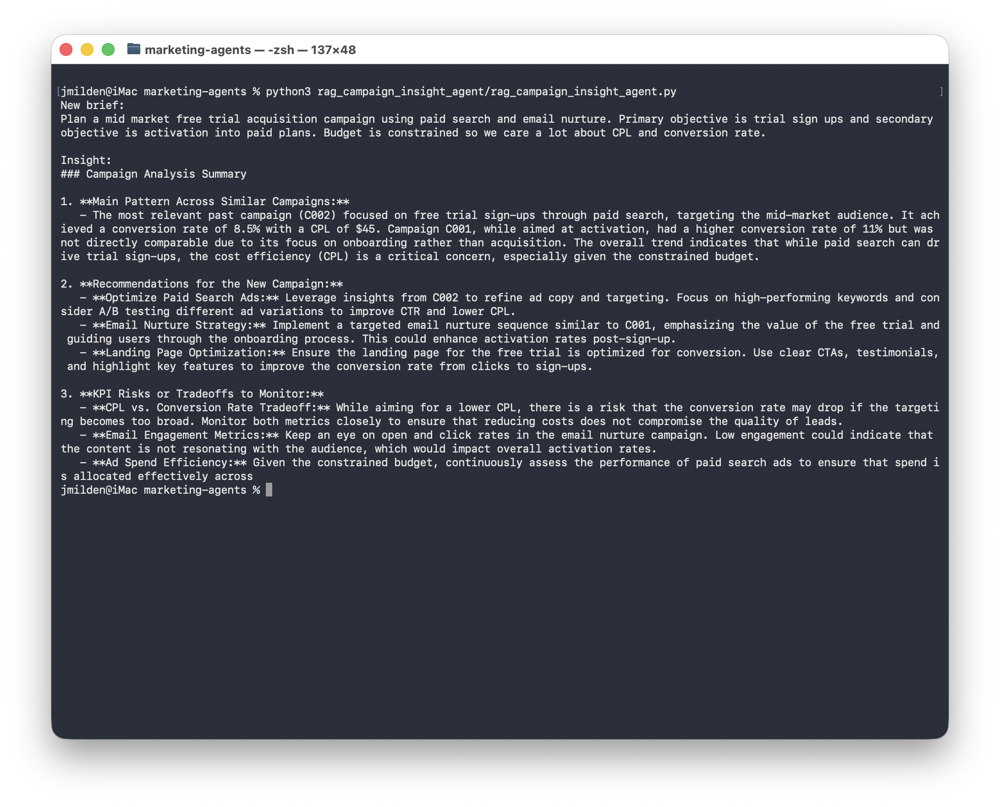

# RAG Campaign Insight Agent

## The Problem
Planning new campaigns without historical context leads to repeated mistakes and missed opportunities. Tribal knowledge lives in spreadsheets and people's heads—not accessible when you need it.

## The Solution
An AI agent that uses retrieval-augmented generation (RAG) to find similar historical campaigns and synthesize actionable insights, recommendations, and KPI risk callouts for new campaign briefs.



## Business Impact
- Instant access to relevant historical campaign learnings
- Data-driven recommendations for new campaigns
- KPI risk identification before launch
- Reduced planning time with automated insight synthesis

## Technical Approach
1. **Campaign Corpus** - Historical campaigns stored in `campaign_history.json`
2. **TF-IDF Vectorization** - Converts campaign descriptions to searchable vectors
3. **Similarity Search** - Cosine similarity ranking finds top 3 most relevant campaigns
4. **KPI Dictionary** - `kpi_dictionary.yaml` provides metric definitions and context
5. **LLM Synthesis** - Generates strategic recommendations and risk callouts

## Skills Demonstrated
- Retrieval-Augmented Generation (RAG) architecture
- TF-IDF vectorization (scikit-learn)
- Cosine similarity search
- OpenAI API integration
- Campaign analytics and KPI frameworks

## Demo
```bash
python3 rag_campaign_insight_agent/rag_campaign_insight_agent.py
python3 rag_campaign_insight_agent/rag_campaign_insight_agent.py "Your campaign brief here"
```

## Installation
1. Clone the repo
2. Install dependencies: `pip install -r requirements.txt`
3. Add your `OPENAI_API_KEY` to `.env`
4. Run the demo with your own campaign brief
